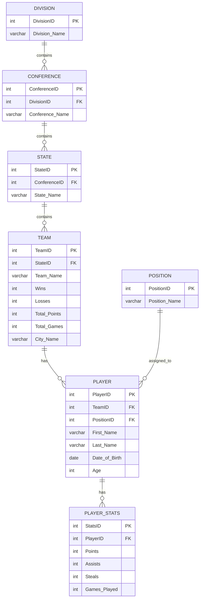

# Sports League SQL Database 🏀

## Overview

This was one of my first database projects in college. I created a fictional basketball league database in MySQL to practice organizing related information across multiple tables.

The database stores information about divisions, conferences, states, teams, player positions, players, and career statistics. I connected the tables using primary and foreign keys so information could be stored without placing everything into one large table.

## Project Details

- **Database:** MySQL
- **Original completion date:** May 2023
- **Tables created:** 7
- **Foreign-key relationships:** 6
- **Sample records:** 63
- **Database name:** `cl_sports_league`

## Database Structure

The database contains the following tables:

| Table | Purpose |
|---|---|
| `division` | Stores the four league divisions |
| `conference` | Stores conferences and connects them to divisions |
| `state` | Stores states and connects them to conferences |
| `team` | Stores team names, locations, records, and statistics |
| `position` | Stores basketball player positions |
| `player` | Stores player information and connects players to teams and positions |
| `player_stats` | Stores career statistics connected to each player |

## Table Relationships



## How the Database Works

The database begins with a division. Each division can contain multiple conferences, and each conference can contain multiple states.

States are connected to teams, and each team can contain multiple players. Every player is also assigned a position and has a related statistics record.

The overall relationship is:

```text
Division → Conference → State → Team → Player → Player Statistics
                                             ↑
                                          Position
```

## SQL Concepts Practiced

This project gave me experience with:

- Creating databases and tables
- Choosing SQL data types
- Creating primary keys
- Creating foreign keys
- Using auto-incrementing identifiers
- Adding `NOT NULL` constraints
- Creating one-to-many relationships
- Inserting sample records
- Connecting related information across tables
- Exporting a MySQL database

## Example Relationship

The `player` table uses two foreign keys:

- `TeamID` connects a player to a team
- `PositionID` connects a player to a position

The `player_stats` table then uses `PlayerID` to connect statistics to the correct player.

This structure makes it possible to retrieve a player's name, team, position, and statistics by joining multiple tables.

## Original Database File

The original MySQL dump is included here:

[View the original SQL database dump](./Database/original-sports-league-dump.sql)

The dump contains the original table definitions, foreign-key constraints, and sample data from the project.

## Importing the Database

The original dump does not automatically create or select the database. Before importing it, create the database using:

```sql
CREATE DATABASE cl_sports_league;
USE cl_sports_league;
```

The SQL dump can then be imported into the selected database through MySQL Workbench or the MySQL command line.

Example command-line import:

```bash
mysql -u your_username -p cl_sports_league < original-sports-league-dump.sql
```

## What I Learned

This project helped me understand why relational databases separate information into multiple connected tables instead of storing everything in one place.

I learned how primary keys uniquely identify records and how foreign keys connect related records between tables. I also gained experience thinking through how different types of information should be organized before building a database.

Since this was one of my first SQL projects, it gave me a foundation that I later used in more advanced database and technology projects.

## Project History

I originally completed this project in 2023 for a college database course.

The original SQL dump is included without changing its schema or sample data. I added this README and the relationship diagram later to better document the project and make it easier for others to understand.

## Data Notes

The project uses fictional and demonstration data created for database practice. It was not intended to be a completely accurate representation of a real professional basketball league.

Because this was an early college project, the original data also contains a few spelling, age, and statistical inconsistencies. I kept the original dump unchanged so that it accurately represents the work I completed at the time.

## Future Improvements

- Add useful SQL demonstration queries
- Create queries that join players, teams, positions, and statistics
- Add reports for team and player performance
- Calculate player age automatically from the date of birth
- Improve validation rules for statistical data
- Create an updated and cleaned version of the database
- Add screenshots from MySQL Workbench
